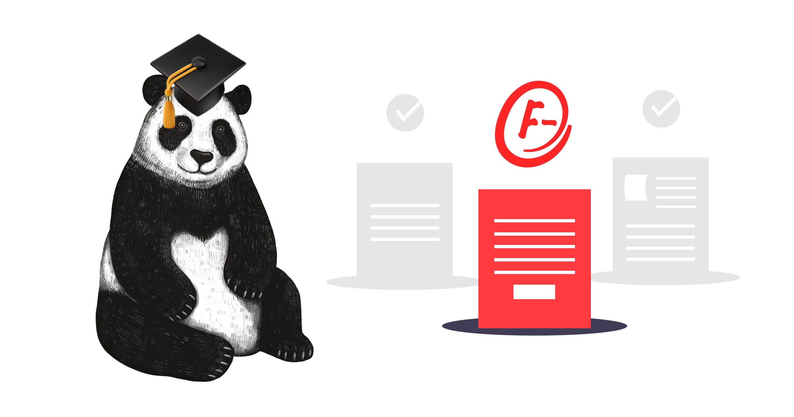

Last year I [outlined the manifesto](/software-is-easy-people-are-hard-a-small-team-lead-manifesto/) that I want to try to follow. I promised I would commit to rating myself every month on these criteria in a scorecard. 

However, I dropped off blogging at the beginning of the year to focus on a few other things, so I’m going to recap 2020 so far instead. 

## 1. Push People, a little. Then some more. 
I would have liked to have spent more time on this at the beginning of this year, we’re a year into the formation of my current team, and things have started to click in the last few months. 

However, I feed that people are becoming a little comfortable. I need to refocus my efforts on this in the next few months. We have recently relaunched the performance enablement program, and I need to get people onto the new version. 

I will give myself 5 points. I help push one of my mentees out of their comfort zone during the process of finding a new position. 

Score: 5/10

## 2. Create an environment of safety.
Had a little wobble with this one in the middle of Q1, some statistical evidence suggested that the general feeling within the team wasn’t high on this topic. But we refocused and put plans in place to give the team members ownership of things that have more impact. 

This process feels like it has had the impact of individuals feeling more aligned with the organisation as a whole. 

Score 8/10

## 3. Manage your relationships.
My relationships are feeling great right now. The team is flowing, and we’re striking a great balance between friends and colleagues. Even with the current climate of having to work from home, the team is enjoying each other’s company. 

I do have some concerns about codependence within the team and what impacts might happen should one of the group be removed, something that I want to try and get my head around over the next couple of months, can you build in safeguards for change within your team?

Score: 8/10

## 4. Get great at giving feedback.
Feedback recently couldn’t be any better. Swamped by millions of feedback forms and processes, we found it hard as a team to keep a focus on giving quick continuous feedback. So we have introduced a feedback metric that we mark ourselves on every week from 0-10 in our retros. This rating has helped keep the feedback process at the front of our minds. 

Score 10/10

## 5. Manage expectations.
Expectation management is going steady, finger in the air estimations have been solid all year. We missed only one deadline, by 3 days, that no one believed we could hit. The delay was mainly ‘readjusting to corona’ issues. 

I do have a big task in the next few months, a culture based project that I’m leading has made some big promises. So we’re going to have to deliver.  

Score 8/10

## 6. Your team will be mimic you, lead by example.
Feels good right now. While we’re on lockdown, I decided to push a few things forward despite the challenge of them being online. We kicked off a JS internal sharing event internally. I focused hard on this blog, and we managed to kick off Cat Herding, an online leadership meet-up heading in a great direction. 

Score: 7/10

## 7. Arseholes are arseholes, however talented they are.
Still no arseholes to contend with recently, beginning to wonder if arseholes are just an agency thing? Or maybe the Swedish vibe mutes any ‘arsholistic’ tendencies. So middle of the road mark for this one this time around. 

Score 5/10

## 8. Consider your biases.
Biases are my area for improvement at the moment. I’ve become overly confident after a year of finding my feet at Klarna, and I catch myself being a little bullish. I’ve caught myself making a few snap ‘gut feeling’ based decisions recently. 

I need to step back a little and make sure I’m more subjective and data-driven. 

Score 4/10

## 9. Balance your team.
Diversity is a weird one for me this time around. I got some great feedback in this area that threw me a little. Somone praised me for ‘lifting up women all the time,’ and it felt pretty strange. I don’t go out of my way to do this. I lift everyone who deserves it. 

At the time, the feedback felt like ‘congrats for not being a sexist prick.’ However, when it settled in, I realised if I’m getting that feedback, we still have so far left to go in this area.

We also managed to line up an entirely female Cat Herding by accident, so I’m giving myself a bonus point for that as well. 

Score 7/10

Total Score: 62/90 Something to build on.