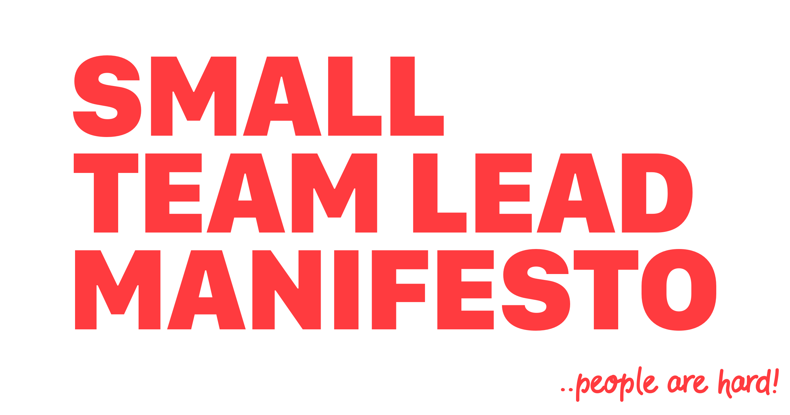

> Leading a small team isn’t sexy. It’s just hard!

The main reason I started this blog was to be able to answer the question “What is it I do?” and “What do I do well?”. I spent quite a lot of time just brain-farting out what I was thinking into a series of blog posts. 

It turns out I know why I couldn’t concisely answer that question because it’s bloody complicated. There are so many things to consider to make sure you’re doing the best you can by your team. 

Over the last couple of months of brain-farting, I’ve started to collect the things I’ve been posting into several categories. These categories have become a ‘manifesto’ for how I *want* to lead a small team. 

## The manifesto.
Software is Easy, People are Hard: a Small Team Lead Manifesto.

Leading a small team isn’t sexy; it’s hard. I will always try and remember:

1. Push People, a little. Then some more.
2. Create an environment of safety.
3. Manage your relationships.
4. Get great at giving feedback.
5. Manage expectations.
6. Your team will mimic you, lead by example.
7. Arseholes are arseholes, however talented they are.
8. Consider your biases.
9. Balance your team.

I will now use this as a framework for how I approach my work. I will review myself against these points every month. Find my first [report card here](/manifesto-score-card-october-2019/). 

## 1. Push People, a little, then some more. 
Despite being the darling of motivational management speakers, the comfort zone is the death of growth. Pushing your team a little bit outside their comfort zone will reward them in the long run.

## 2. Create an environment of safety.
Most people don’t like pain of any form. Give your team space they can try and fail without significant pain, and it will give them space to grow. 

## 3. Manage your relationships.
Work relationships are a fantastic tool but also a dangerous weapon. Be careful to balance your work relationships to allow your team to be fun and functional. However, be cautious of letting emotions interfere with your decisions. 

## 4. Get great at giving feedback. 
If you want to see growth in yourself and others, then regular, honest, factual and timely feedback is essential. Get great at giving feedback.

## 5. Manage expectations.
Being able to set, review and meet expectations is the key to successful delivery. Without everyone being on the same page, you are destined to fail. 

## 6. Your team will be mimic you, lead by example.
Your team will look up to you, and copy your strongest traits, good and bad. Keep in mind how you act and hold yourself to the same standards you expect from your team. 

## 7. Arseholes are arseholes, however talented they are.
Arseholes are toxic. You should never tolerate toxic behaviour, under any circumstance. Deal with it in a timely, fair, factual manner. 

## 8. Consider your biases, balance your team.
Everyone has biases. You will have formulated options of people and situations over your career. Developing stereotypes is hard to avoid. However, be aware of your own biases; make sure they don’t impact your choices and actions.  

## 9. Balance your team.
If your team consists of straight, white, middle-aged men, you will build great products for straight, white, middle-aged men. The more balanced your team is, the more balanced your product. 