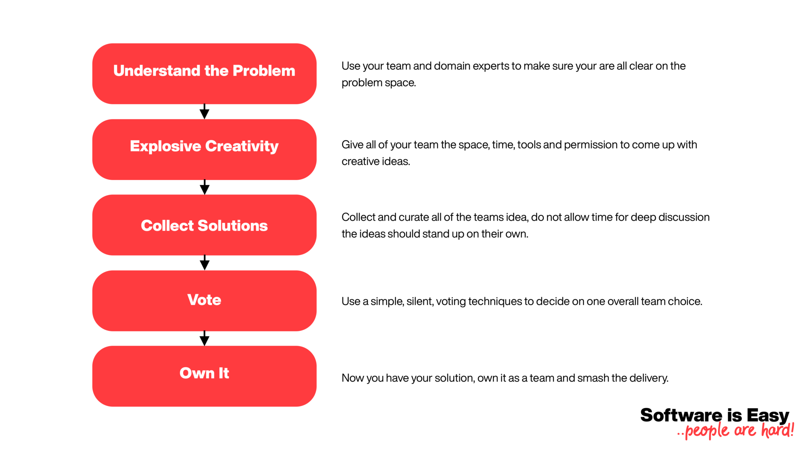

At Klarna, we hire amazing people. This statement isn’t hyperbole. I’ve not met one person in the year that I’ve been at Klarna who didn’t impress me in some way.

But one thing that I’ve learned this last year is that if you put a group of amazing people in a room, they struggle to make decisions. The deeper a team thinks about its problem space, the more it generates strong, convincing ideas and solutions. And therefore, the harder it is for the team to decide how to move forward.

In this article, I will explain how we’re using structured, collaborative, and fun decision making processes to help drive our team forward and have maximum impact on our problem space.

## Collective Analysis Paralysis
Analysis Paralysis is the concept that an individual can over-analyze a problem and block themselves from moving forward with a solution. The paralysis problem is exacerbated when a group of highly analytical individuals come together as a team.

Klarna hires against a set of leadership principles. These principles define how we go about delivering products. One of those principles is ‘Detailed Thinkers’.

Leaders know that to be a disruptor in a competitive industry requires radical, detailed thinking. They are ambitious and communicate a daring direction that inspires results, but they also love details and have a contagious desire for knowledge. They leave no stone unturned when it comes to finding Smoooth solutions. Nothing is impossible. They are a unique combination of ambitious, free-thinking with a meticulous eye for detail.

As a result, we end up with teams with strong analytical skills. This is what happened in my team. The result is impressive people who struggle to make collective decisions. We are great at generating concepts, ideas, and potential solutions, but agreeing on the right outcome has always been a challenge.

## The Problem with Deadlock Breaking.
As a manager, or lead within a team, it’s your responsibility to break these kinds of stalemate situations. And there’s an easy solution to this. As the lead, you get a single overriding vote to unblock the discussion and move the team forward.

This single vote is traditionally what managers do. They use their wealth of experience and knowledge to choose the right option. However, this veto vote has two significant challenges associated with it; bias, and ownership.

### Challenge 1: Bias
As a manager with 20 years of industry experience, I have biases. I actively try to keep them in check but the situations that I have experienced over my career have built up a set of subconscious patterns in my decision making. If I make the final call, it will be based more on my knowledge and understanding than the collective consciousness of the team.

### Challenge 2: Ownership
The second challenge is that, as the lead, I now own that decision. It’s mine and it doesn’t fully belong to the team. If we had multiple conflicting ideas to start with, I have dismissed the ideas of a proportion of the group. 

This is manageable with good leadership skills, but it would have been a whole lot better if we had collaboratively made that choice.

# Unblocking Collaboratively in 5 Easy Steps.
As a team, we use several tools to help us make significant decisions collaboratively. Two of these tools are Design Sprints for larger problems and Lightning Decision Jams for smaller ones.

The Design Sprint is a week-long five-phase process that helps teams use design thinking to come up with awesome product ideas. The Lightning Decision Jam is a similar process that focuses on a similar set of phases into the time slot of a single meeting.

What is shared with both of these processes is that they follow a tight timeline that allows you to use the best elements of your team to come to fantastic decisions.

### 1. Understand the Problem.
The first step in any decision-making process is fully understanding the problem you’re trying to solve. It would be best if you had a detailed outline of what you want to achieve as a team before doing any problem-solving. If you’re all trying to solve different problems, you’re already setting off on the wrong foot.

When pushed for time, you can use your team to perform this step. However, when you have the luxury of time, it’s great to get domain expert views on the problem. The Design Sprint sets aside a time that allows you to invite experts into your session and interview them to gain a better understanding of the problem area.

### 2. Explosive Creativity.
Never discredit the hidden skills in your team. In talented, deep-thinking teams anyone can come up with the best solution for your customer, not just the designers and product managers.

Get everyone in on the solutions part of the process, give them all time to draft, sketch and propose ideas. Give them permission to be creative.

Both of these processes use the concept of ‘working alone together’. They let each teammate work on the solutions process independently but in the same physical space.

The outcome of this step is a ton of fantastic ideas.

### 3. Collect Solutions.
Now that you have at least as many great ideas as you have great minds in your team, it’s time to collect and present the ideas.

These ideas should be presented with minimal discussion. The concept is that the ideas should be clear and stand up on their own, without spending time digging into the details.

If the idea is great, then you should need no more than a few sketches and three minutes of your time to describe it. If the concept can fit on one post-it note, all the better.

### 4. Vote.
Now to make the decision. In all of these processes, the voting step is simplest; everyone gets some voting points; they spread the voting point between the ideas that they think are best.

The best idea wins.

It’s that simple; immediately you’ve got down from several awesome ideas to the one the team collectively thinks is the best.

Time to deliver!

### 5. Own it.
What is so amazing about this process is that involving the whole team in every step of the process breeds a fantastic level of ownership. These solutions belong to the group, not the manager, designer, or product owner.

We are all building the thing that we all chose to create, and we’re going to smash it as a team!

## Next Steps.
To run a similar process, you only really need one thing, a facilitator. That person can be anyone in the team, so it could easily be you.

Getting an agreement for a team to spend a whole week on a design sprint can be challenging, the first time. What I would recommend is next time you have a problem, and you can’t collectively agree on the best way forward, use the Lightning Decision Jam process or define something very similar.

Once you have built confidence in this process, you will find it easier to convince people that the investment of a Design Sprint is worthwhile.

I can promise you that once you’ve run one Design Sprint, you’ll have plenty of evidence to convince people to do more.