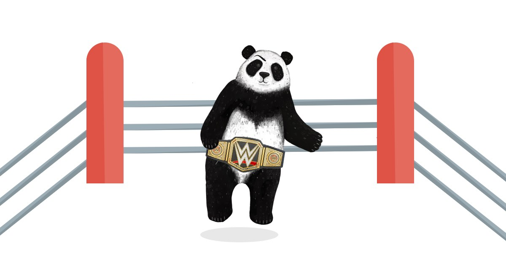

I was recently 'Netflix shamed' by a colleague. During a presentation, they mentioned that they liked to spend the little free time available to them, as optimally as they could. Rather than wasting time aimlessly flicking through Netflix, they would prefer to watch something educational or learn a new skill. 

I felt mildly attacked. One of my favourite past times is watching trashy shows on Netflix. I was probably the data anomaly that made them create the 'are you REALLY still watching this crap?' feature. 

## Side Hustle Shame.

Although my colleague had no ill intent, this pattern is seen a lot on social media. Life hacking, entrepreneurial, successful side hustle types telling you that they spend all of their available time bettering themselves, and you should as well. 

Stories about Elon Musk reading a book a day when he was starting out his career and how all super successful people wake up at 4am for 4 hours of self-betterment and work before the rest of the lazy slobs start bashing your snooze button. 

Who can forget Mark' Marky Mark' Wahlberg's ridiculous daily schedule? 

The only things I can relate too are the snacks.

But I worry this side hustle shame is an unattainable goal for most, putting pressure on the rest of us to push our selves too hard and towards our own burnout. 

## Selling Sunset

So instead of waking up at ungodly hours, to read books, perform hours of the latest meditational yoga trend and spit guilt-emails at all your colleagues about how much work you did over the weekend; I prescribe an alternative. 

Trash TV and 'terrible' movies. 

My current favourite TV show is Selling Sunset, a program about a bunch of well-dressed drama fulled sycophants, and two handsome mini twins who sell multi-million dollar mansions in the Hollywood Hills, it's AMAZING. 

I'm also a major fan of movies it's Dwayne' The Rock' Johnson in them. I find his presence in a film almost (Be Cool excluded) guarantees an entertaining, high octane quality movie. 

And watching this stuff I think is one my keys to success.

## Brain Rest

My avid passion for both trashy TV and The Rock can sometimes come as a bit of a surprise to people when they first find out. I'm a reasonably intelligent and cultured middle-aged guy, probably not the person that the commissioning board had in mind when these shows and movie were pitched.

But actually, I find them a kind of therapy. 

## Fun Therapy. 

Before I continue, I would like to clarify that I'm not trying to pretend that I watch this stuff 'ironically'. I genuinely love watching this stuff, I find it enjoyable. These things are not 'guilty pleasures' they are just pleasures.

But the significant benefits I find in this type of viewing is the mindlessness of it all—the ability to switch off and not think about things for a few hours. 

I do all my thinking in front of a computer screen, I don't want to invest any more brain cycles trying to work out what David Lynch and Charlie Kaufman are trying to tell me about the world, or what the actual fuck is going on in Dark.  

## Rest your most valuable asset. 

You hear a lot that 'the brain is just like a muscle'. I've been reading some psychology books recently, and it really is **not**. However, what the brain and muscles do have in common is that they need rest. 

For me, the perfect rest for my brain is an easy to enjoy action movie with a lot of things exploding and a couple of over the top, hammy, but charming actors duke it out to save the world. 

An evening in front of Netflix recharges my brain, allowing me to come into work the next day with all my neurones firing. 

## Lazy Shaming

So don't feel guilty about that 'mindless' past time that you like to participate in, it's not 'rotting' your brain. It's recharging it. 

Fire up your Candy Crush Saga, plug in your PlayStation, read that trashy gossip website that you love, mindlessly skip through those Tik Tok videos of cute puppies falling off things. 

Then wake up the next day with your brain on full-charge, ready to kick ass. 