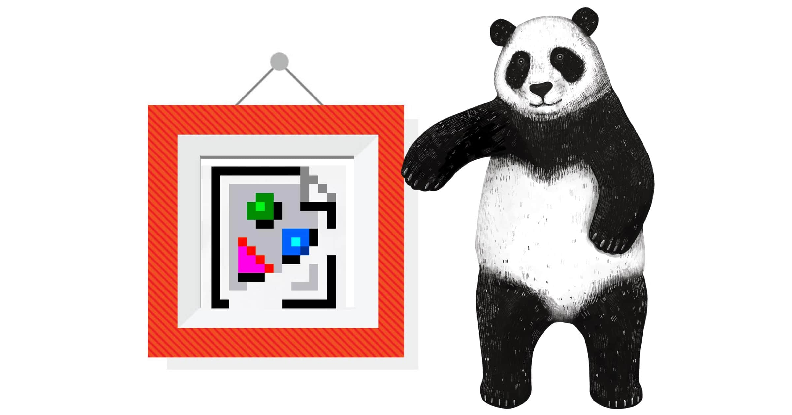

I avoided for a long time jumping on the bandwagon and writing a post about working from home in the ‘new normal’. It’s been done to death, and I didn’t feel I could add anything beyond:

> Wash and put on some pantaloons. 

But for me, there have been two lifesavers during this time of enforced working from home. Track-pants and Animated GIFs. 

The first of these has been a revelation for me. I’m not sure how I’m going to readjust to ‘hard trousers’ when I get back to the office. 

The Importance of the Animated Graphics Interchange Format!
Animated GIFs, however, have been my favourite communication tools for ages, and it feels that maybe people are catching on to their benefits of them in a work environment. 

For many years I had been derided by peers for my unprofessional overuse of GIFs and Emojis. When I tried to introduce Slack to a company a few years ago, I almost got fired for the chaos that ensued when I implemented the GIPHY integration into the platform. 

But in all seriousness, GIFs solve a severe problem of the modern workplace. GIFs are the body language and tone of voice of online communications. 

The Missing Communication Tools. 
When we communicate in person, only a small amount of the message that we deliver is from the word that you use. Some studies even suggest it’s as low as 7%. The rest is made up by your body language and the tone of voice that you are using. 

When we communicate via written communications, you lose both of those things. It’s so much harder to understand the real feeling when reading text that talking to someone face to face. 

Well Done!
The explosion of GIFs in the last 10-15 years is testament to their powerful ability to put a tone of voice back into online communication. From a technical point of view, they’re a terrible inefficient form of communication. Yet they are still a significant part of internet communications. 

But they work. If you’re not convinced, then here’s an example. If you had a significant achievement at work, which of the following would you prefer to receive as feedback?

> Well Done!

Or

> Well Done 👏🏾

Or

Case closed, use GIFs.

