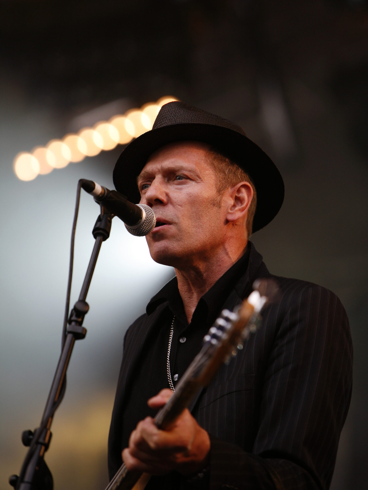

When I grow up, I want to be Paul Simonon, the bassist from The Clash. Co-founder of one of the world’s most [influential punk bands](https://en.wikipedia.org/wiki/The_Clash), undercover [Greenpeace activist](https://www.straight.com/blogra/amazing-secret-life-clash-bassist-paul-simonon), inordinately handsome, and an outstanding wearer of hats. 

Paul Simonon is one of my role models and sits alongside a wide range of ex-manager, teammates, and colleagues who have had an impact on me throughout my career. 

My whole professional persona contains little bits of people who I’ve worked with before. There is a little bit of my ex-business partner Karl, who taught me about loyalty. I always try my hardest to make sure that whatever I’m pitching to people is easy to buy, that comes from Ed, a creative director I worked for early in my agency career. The overall quality of delivery has become majorly important to me, a trait I have partly inherited from my last CEO, Steffen. 

I’m the mutant bastard offspring of all the influential individuals that I’ve worked with over the years, at least in a professional sense. 

## Do as I do, not as I say. 
But did these individuals tell me to do these things? Did they teach me with PowerPoint presentations and documented guidelines?

No, they didn’t. These people taught me by personifying these traits. By believing in themselves and holding themselves accountable for the things they held important every day of their working week. 

They did things in these specific areas that, at the time, I thought was over the top; extreme in some cases. But over time, I saw the results that they got from these focuses, and that changed my core professional belief system.

## Mimics. 
I’ve been aware of these influences for quite some time. I frequently find myself thinking, ‘what would [insert name here] do?’ when I’m in tricky situations—the name changing depending on the challenge I’m facing at that time. 

But only recently, I started to notice the same patterns in the people that I was managing. But not in a positive way, the team seemed to be picking up no my bad traits, and copying them. 

I am a terrible scheduler and planner. I use ‘gut feeling’ and ‘experience’ to make sure projects get done on time. An ability to keep an overall view of all the ongoing project statuses in my head at any one time allowed me to juggle and shuffle tasks around very dynamically to get projects over the line in the right order. 

Running projects like this makes a lot of people very uncomfortable because there’s no visible plan, but I knew what was going on. Working like this had worked for years while I was a freelancer, so why wouldn’t it work now?

What I then started to see was the rest of the team were applying the same methodology, no personal time planning. Just doing what it looked like I was doing. Which was running at a task and letting the schedule and planning ‘work it’s self out’. 

I hadn’t asked them to do this, the company I was working for at the time had well-documented tools and processes for keeping track of your progress on the work that you were doing. They all just ignored that and did what I was doing, which was keeping things in their heads. 

This ended in disaster. 

## I was the role model. 
It then became clear that, for better and worse. I was also a role model; people were looking up to me for that guidance that I seek for in others. 

Just like I had done before, my team was copying what I did, not what I told them to do. 

I now try to consider all my traits when leading a team. For example, I’m a firm believer that ’40 hours are enough.’ I try my hardest to keep to that rule. You will very rarely see me in an office after 5:30PM. So far, I think this has helped me inspire a healthy work-life balance within my team members. 

## You’re always a role model. 
It took me a long time to realise it, but when the realisation struck me that I was a role model, I realised it wasn’t something that hadn’t just happened that week. 

I had always been a role model; everyone is always a role model. 

The second you get to the point in your career when you’re interacting with someone who has less experience than you, they will be looking to you for guidance on how they should do things, maybe subconsciously, but frequently not. 

## Be the hero you want to be, not the hero you think you should be. 
So, we’re all role models? What should we do with this information? 

To be the best role model, you can’t fake it. Be honest with yourself, what is it that you care about? What do you want to see in the individuals you work with?

Work out who your perfect colleague is, then strive to become that person. You’ll undoubtedly fail along the way. However, if the people around you see the heart and belief in what you’re doing, they will forgive you when you fall down. 

They might even help you back up. 